# agentic-review-gate

A production-grade **multi-agent PR review system** using the **Shared State (Blackboard) Pattern**. Each specialized agent analyzes code independently, deposits findings on a shared state, and a final Synthesizer produces professional GitHub comments.



## ⚡ Quick Features

✅ **Multi-Agent Analysis** - Logic, Security, and Summarizer agents run in parallel  
✅ **No Context Loss** - Blackboard pattern eliminates message chaining fatigue  
✅ **AI-Powered** - LLM integration for semantic code analysis  
✅ **GitHub Integration** - Automatic PR reviews via webhooks  
✅ **Production Ready** - v1.0.0 includes secret redaction, token budgeting, CI feedback  

## 🚀 Quick Start

### Installation
See [SETUP.md](docs/SETUP.md) for detailed installation with environment variables, LLM setup, and webhook configuration.

```bash
git clone https://github.com/pvenkata-tech/agentic-review-gate.git
cd agentic-review-gate
python -m venv venv && source venv/bin/activate
pip install -e ".[dev,llm]"
python -m code_reviewer.main
```

Server runs at `http://localhost:8000`

## 📊 How It Works

```
GitHub PR → [Logic Agent] ──┐
            [Security Agent]├──> ReviewState (Blackboard) ──> Summarizer ──> PR Comment
                             └───────────────────────────────┘
```

**Phase A (Parallel)**: Logic and Security agents analyze independently  
**Phase B (Sync)**: Check for critical issues, set blocking status  
**Phase C (Synthesis)**: Deduplicate findings, generate professional comment  

Performance: ~600ms-1s (heuristic), 5-20s with LLM

## 📚 Documentation

| Document | Purpose |
|----------|---------|
| [ARCHITECTURE.md](docs/ARCHITECTURE.md) | System design, patterns, and extending |
| [SETUP.md](docs/SETUP.md) | Installation, env config, LLM providers |
| [INTEGRATION.md](docs/INTEGRATION.md) | GitHub webhooks, API endpoints, deployment |
| [OPERATIONS.md](docs/OPERATIONS.md) | Testing, monitoring, v1.0/v1.1 features |

## 🔌 API Endpoints

| Method | Path | Purpose |
|--------|------|---------|
| `POST` | `/review` | Trigger PR review |
| `POST` | `/webhook/github` | GitHub webhook receiver |
| `GET` | `/health` | Health check |

Example:
```bash
curl -X POST http://localhost:8000/review \
  -H "Content-Type: application/json" \
  -d '{"pr_number": 123, "owner": "org", "repo": "name", "github_token": "ghp_..."}'
```

## 🔧 Configuration

Required environment variables (see `.env.example`):
```env
GITHUB_TOKEN=ghp_your_token
GITHUB_OWNER=your_org
GITHUB_REPO=your_repo
ANTHROPIC_API_KEY=sk_ant_xxx
```

Optional:
```env
LOG_LEVEL=INFO
USE_LLM_LOGIC=true
USE_LLM_SECURITY=true
```

## 🎯 Key Principles

1. **Loose Coupling** - Agents interact only via shared state, no direct communication
2. **No Context Loss** - Summarizer has access to all findings and their context
3. **Parallel Execution** - Logic & Security agents run concurrently (50% faster)
4. **Intelligent Deduplication** - Overlapping findings merged automatically
5. **Professional Synthesis** - Tone-matched, severity-ranked output

## 📈 v1.0.0 Features

- **Secret Redaction**: Masks API keys, passwords, AWS credentials before LLM processing
- **Token Budgeting**: Intelligent file prioritization (Python > JavaScript > others)
- **CI Feedback Loop**: Posts error comments when reviews fail
- **Senior Tone**: Elevated architectural guidance instead of "Line X is wrong"

## 📦 Project Structure

```
src/code_reviewer/
├── agents/          # Logic, Security, Summarizer agents
├── core/            # Coordinator, ReviewState, GitHub client
├── llm/             # LLM provider integrations
├── prompts/         # Agent analysis prompts
├── utils/           # Cache, diff parsing, logging
└── main.py          # FastAPI server
```

## 🧪 Testing & Development

```bash
pytest                              # Run all tests
pytest --cov=src/code_reviewer     # With coverage
black src tests && ruff check      # Format & lint
```

See [OPERATIONS.md](docs/OPERATIONS.md) for testing PRs and webhook debugging.

## 🤝 Contributing

1. Fork the repo
2. Create feature branch: `git checkout -b feature/awesome`
3. Make changes, add tests
4. Format: `black src tests`
5. Lint: `ruff check src tests`
6. Push and submit PR

## 📄 License

MIT

## 💬 Support

- **Issues**: https://github.com/pvenkata-tech/agentic-review-gate/issues
- **Docs**: See [Documentation](#-documentation) links above